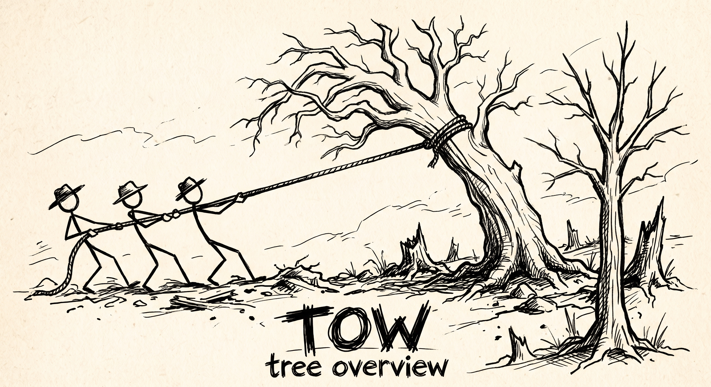

# tow

> [!NOTE]
> 
> This is project is mainly build by AI agents.



`tow` gives you a quick, readable overview of an unknown or forgotten project.
The classic `tree` prints everything, `tow` collapses files and folders, has git
integration and more highlighting tools.

- Shows a couple of **exemplary files** per file type, then summarizes the rest
  (`… 7 more .py`) instead of dumping all, has logic to always show important files.
- Fits the overview onto **one screen**, reporting hidden directories
  (`… 3 directories hidden`) that `--all-dirs` reveals, has logic to prioritize
  which directories to show first/last.
- Colors file types consistently, highlighting the extension (`.py` always
  blue, `.rs` always orange, …).
- Annotates each file with its **last commit** (hash, date, subject), truncated
  to your terminal width.
- Shows gitignored files by default; `--gitignore` hides them.
- Aggregates **directory sizes** with `-s` / `-h` / `--si`.

## Install

### Prebuilt binary

Linux (x86_64 / aarch64) and macOS (Intel / Apple Silicon) builds are published
on the [releases page](https://github.com/samuelhomberg/tow/releases). The
installer drops `tow` into your Cargo home (`~/.cargo/bin` by default):

```sh
curl --proto '=https' --tlsv1.2 -LsSf \
  https://github.com/samuelhomberg/tow/releases/latest/download/tow-installer.sh | sh
```

### From source

```sh
cargo install --path .
```

Or build and run in place:

```sh
cargo build --release
./target/release/tow
```

## Usage

```sh
tow                 # the current directory
tow --gitignore     # hide .gitignored files
tow --limit 5       # show more files per supdirectory
tow -L 2            # limit depth
tow -h              # sizes (files + directories), human readable
tow --recent        # flat list of recently committed files
tow -P *.rs --limit 5 --all-dirs --prune # find up to 5 rust files per subdirectory
```

### A quick example

A Python project with a busy `src/`:

```
$ tow
.
├── src
│   ├── main.py
│   ├── utils.py
│   └── … 7 more .py
├── tests
│   ├── test_main.py
│   └── test_utils.py
├── pyproject.toml
└── README.md

2 directories, 6 files
```

Instead of nine `.py` files you see two plus a one-line summary. `main.py` (an
entrypoint) and `pyproject.toml` / `README.md` (anchors) always surface even in
a crowded tree.

### Git history

Inside a git repository, each file is annotated with its last commit, truncated
to the terminal width (the hash and date drop first when space is tight):

```
$ tow
.
├── src
│   └── lib.rs  91774e2  2026-09-22 08:00  fix: tweak lib something very long that should b…
├── README.md  9bcac00  2026-09-23 07:00  docs: readme
└── main.rs  69adfaf  2026-09-20 10:00  init: add main
```

`--no-commits` hides the annotations; `--full-commits` always shows the full
hash, date, and subject regardless of width. The `--recent` flag prints a flat
list of the most recently changed files — which works even in a freshly cloned
directory, where every file's modification time is just "now":

```
$ tow --recent=3
9bcac00  2026-09-23 07:00  README.md  docs: readme
91774e2  2026-09-22 08:00  src/lib.rs  fix: tweak lib something very long that should b…
69adfaf  2026-09-20 10:00  main.rs  init: add main
```

## How it decides what to show

**Files** are assigned a priority tier:

1. **Entrypoints** (`main.*`, `index.*`, `app.*`, `server.*`, `lib.*`, `cli.*`,
   `manage.py`, `wsgi.py`, `asgi.py`, `setup.py`, …) — always shown, listed
   first. (Package/module markers like `__init__.py` and `mod.rs` are *not*
   entrypoints — they'd just add noise to every package directory.)
2. **Anchors** (`README*`, `LICENSE*`, `Cargo.toml`, `package.json`, `go.mod`,
   `pyproject.toml`, `Makefile`, `Dockerfile`, …) — always shown.
3. **Everything else** — grouped by file type and capped at `--limit` (default
   2) per type, ordered by last-commit time (then mtime, then name).

**Directories** are sorted by class — *protected* (`src`, `tests`, `docs`, …)
first, then ordinary, then *noise* (`node_modules`, `target`, `build`, …) last.
On an interactive terminal, `tow` fits the overview to the screen by hiding
directories from the bottom (noise first), reporting the count *and shape* of
what was hidden — e.g. `… 200 directories hidden (one directory, 200 subdirs)`
vs `… 200 directories hidden (10 roots, ≤20 subdirs, 2 deep)`. Protected
directories are never dropped. `--all-dirs` disables this collapsing, and
`--height N` sets an explicit line budget (even when piping).

The exact tier and class lists are configurable — see below.

## Configuration

`tow` merges three layers of rules, lowest precedence first:

1. Built-in defaults.
2. The user config — `--config PATH`, then `$TOW_CONFIG`, then
   `$XDG_CONFIG_HOME/tow/config.toml` (default `~/.config/tow/config.toml`).
3. A project `.tow.toml`, discovered by walking up from the current directory.

`--no-config` ignores all config files. `--dump-config` prints the merged
effective config as TOML (a ready-made template):

```toml
[files]
entrypoints = ["main.*", "index.*", "app.*", "server.*", "lib.*", "cli.*", "manage.py", "wsgi.py", "asgi.py", "setup.py"]
important  = ["README*", "LICENSE*", "Cargo.toml", "package.json", "go.mod", "pyproject.toml", "Makefile", "Dockerfile", ".gitignore"]

[dirs]
protect = ["src", "lib", "app", "cmd", "internal", "pkg", "include", "tests", "test", "docs", "examples", "bench", "scripts", "tools"]
noise   = ["node_modules", "target", "build", "dist", "out", "vendor", "coverage", "__pycache__", ".git", ".venv", "venv", ".tox", ".idea", ".vscode", ".gradle", "debug", "release", ".pytest_cache"]

[display]
collapse  = true   # fit one screen (interactive terminals only)
gitignore = false  # hide files matched by .gitignore by default

[defaults]
max_depth   = 0      # 0 = unlimited
height      = 0      # 0 = auto (terminal height)
width       = 0      # 0 = auto (terminal width)
limit       = 2      # files shown per type per directory
max_files   = 50000  # 0 = unlimited
max_dirs    = 10000  # 0 = unlimited
max_commits = 50000  # 0 = unlimited
```

Any explicit command-line flag overrides the matching `[defaults]` value.

Patterns are globs matched against the file or directory basename.

## Options

| Option | Description |
| --- | --- |
| `-a, --all` | Include hidden files |
| `--gitignore` | Hide files ignored by `.gitignore` (overrides config) |
| `--no-gitignore` | Show files ignored by `.gitignore` (overrides config) |
| `-L, --max-depth N` | Limit tree depth |
| `-d, --dirs-only` | Directories only |
| `-f, --full-path` | Print full path prefixes |
| `--limit N` | Files shown per type per directory (default 2) |
| `--select MODE` | `important` (default), `recent`, `modified`, or `name` |
| `--sort KEY` | `name`, `mtime`, `commits`, `size`, `version`, or `none` |
| `-r, --reverse` | Reverse sort order |
| `--filesfirst` | List files before directories |
| `--commits` / `--no-commits` | Toggle last-commit annotations |
| `--full-commits` | Always show full commit info (no width truncation) |
| `--recent[=N]` | Flat list of N most recently committed files |
| `-s, --size` | File + directory sizes in bytes |
| `-h, --human` | Human-readable sizes (powers of 1024) |
| `--si` | Human-readable sizes (powers of 1000) |
| `--du` | Alias for directory sizes |
| `-D, --date` | Last modification date |
| `--timefmt FORMAT` | strftime date format (implies `-D`) |
| `-P PATTERN` / `-I PATTERN` | Include / exclude glob patterns (repeatable) |
| `--prune` | Prune empty directories |
| `--noreport` | Omit the final report line |
| `--no-important` | Disable the anchor boost |
| `--all-dirs` | Show all directories (disable screen-fit collapsing) |
| `--height N` | Limit the tree to N lines (forces collapsing) |
| `--width N` | Override terminal width for commit truncation |
| `--max-files N` | Stop walking after N files (default 50000; `0` = unlimited) |
| `--max-dirs N` | Stop walking after N directories (default 10000; `0` = unlimited) |
| `--max-commits N` | Scan at most N commits for history (default 50000; `0` = unlimited) |
| `-F, --classify` | Append `/`, `*`, `@` to dirs, executables, symlinks |
| `-i, --noindent` | No indentation lines |
| `-l, --follow` | Follow symlinks to directories |
| `-C` / `-n` / `--color WHEN` | Force / disable / auto color |
| `--config PATH` | Use this config file instead of the user default |
| `--no-config` | Ignore all config files |
| `--dump-config` | Print the merged effective config as TOML |

Color respects the usual environment variables: `NO_COLOR` disables it and
`CLICOLOR_FORCE` forces it. `LS_COLORS` is honored when set, with a built-in
scheme as fallback.

## How it differs from `tree`

`tree` lists everything; `tow` summarizes. `tow` reuses the `tree` options that
make sense for a quick overview (`-a`, `-L`, `-d`, `-f`, `-I`, `-P`, `-h`,
`--si`, `--du`, `-D`, `--timefmt`, `-F`, `-i`, `-r`, `--prune`, `--noreport`)
and adds its own: entrypoint/anchor surfacing, per-type collapsing, directory
classes, screen-fit collapsing, git history annotations, `--recent`, and a
configurable rule system.

## Development

```sh
cargo test          # unit + integration tests
cargo clippy        # lint
```

Integration tests build throwaway directory trees (and real git repositories
with fixed commit timestamps) to verify filtering, collapsing, sizing, history,
config, and width/height handling. See `tests/cli.rs`.
